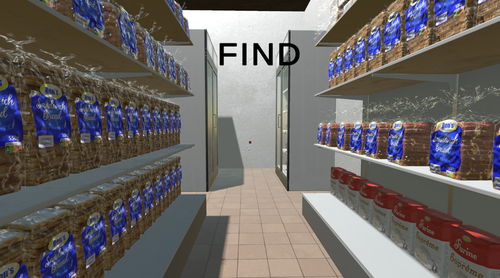
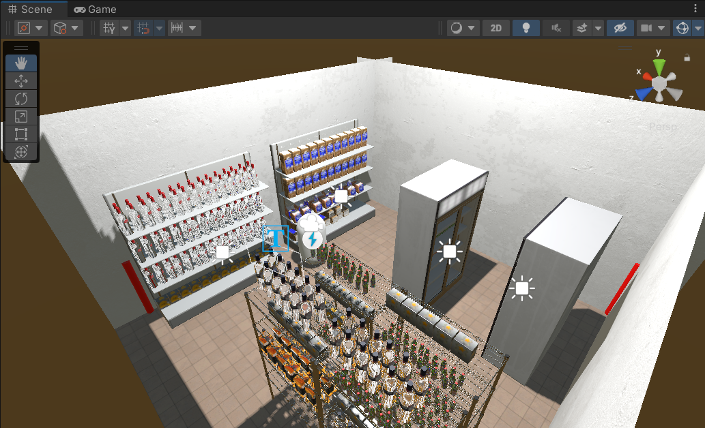
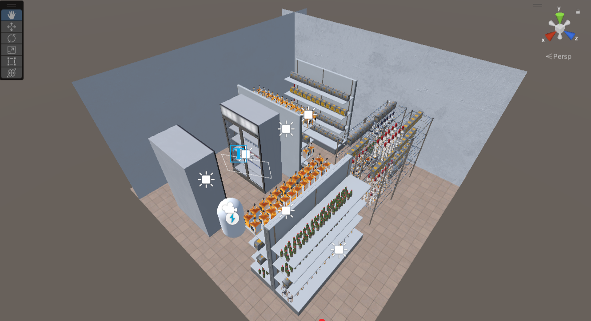

# Procedurally Generating Supermarket
This project was made to create unique VR search environments for the Spatial Behaviour Lab at University of Plymouth. This uses Perlin noise to select what premade chunks appear, along with what type of items appear there. There currently aren't many different chunks, but this can very easily be added upon in the future. The environment is designed for a 6x6m room, which is the size of the Psychology VR lab. However this can
be altered for bigger/smaller rooms. Unfortunately, a fully functioning project cannot be provided here due to the use of paid assets but the code is provided and screenshots are below.

## Screenshots

